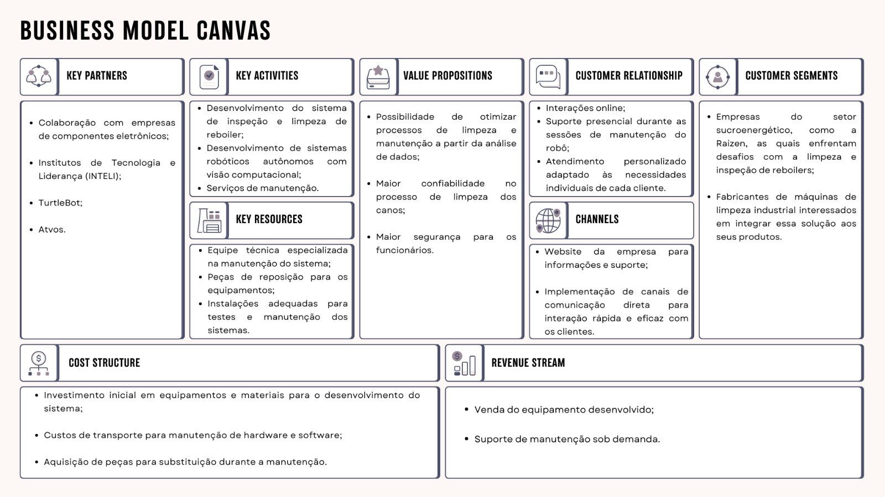

# Business Model Canvas

O Business Model Canvas é uma ferramenta estratégica essencial para o desenvolvimento de modelos de negócios novos ou para a documentação e aperfeiçoamento de modelos existentes. Composto por nove blocos de construção — Segmentos de Clientes, Propostas de Valor, Canais, Relacionamento com Clientes, Fontes de Receita, Recursos Principais, Atividades-Chave, Parcerias Principais e Estrutura de Custos —, o canvas proporciona uma visão clara e concisa de como uma organização cria, entrega e captura valor.

