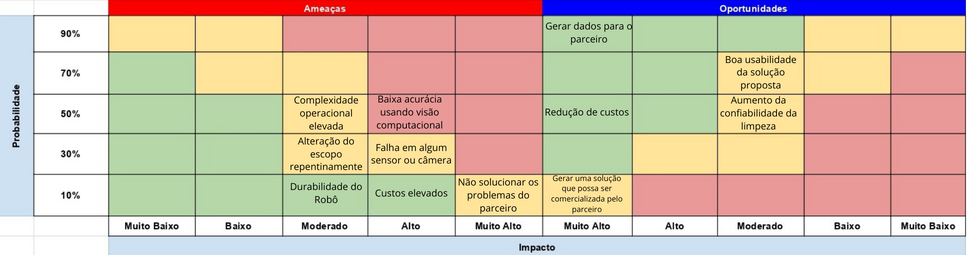

# Matriz de risco

No campo da gestão de projetos e operações, uma matriz de risco é uma ferramenta analítica projetada para auxiliar na identificação e avaliação de riscos potenciais. Utilizar uma matriz de risco é fundamental para entender a probabilidade e o impacto de diferentes riscos, possibilitando uma gestão mais eficaz e prevenção de problemas. O processo envolve a categorização dos riscos com base em critérios como severidade e frequência, facilitando a priorização de ações e a alocação de recursos.

Essa ferramenta não é um elemento estático, mas é moldada a partir de informações detalhadas sobre as vulnerabilidades e ameaças específicas do projeto ou operação em questão. A matriz de risco ajuda os gestores a tomarem decisões mais informadas, equilibrando entre riscos e oportunidades. Inclui detalhes como cenários de risco, níveis de tolerância e estratégias de mitigação. Orienta todas as etapas do projeto, assegurando que a gestão de riscos permaneça alinhada às metas e objetivos estratégicos.

No contexto deste projeto, a matriz de risco será a base para garantir que nossa abordagem seja proativa em relação aos desafios e incertezas. Ela capacita as equipes a desenvolverem respostas estratégicas e a manterem a resiliência operacional, fundamentais para o sucesso do projeto. Abaixo, apresentaremos uma visão geral sobre a matriz de risco desenvolvida pelo nosso grupo.

---

## Contenção de riscos

---

&emsp;&emsp;Custos elevados : Para evitar que o projeto tenha custos muito elevados para o parceiro, vamos procurar por robôs, câmeras e sensores que possam lidar especificamente com as condições do projeto, sem gastar demais com os componentes da solução, mas garantindo que possam resistir e ser durável por um tempo razoável estipulado sem a necessidade de sua troca.

&emsp;&emsp;Complexidade Operacional elevada : Para que nossa solução não exija que a Atvos ofereça demasiado treinamento especializado para os operadores da solução, faremos testes com usuários de nivelado letramento digital a fim de garantir o fácil uso da solução.

&emsp;&emsp;Falha em algum sensor ou câmera : Realizar diversos testes com vários modelos de sensores e câmeras e indicar aquele que tem a menor taxa de falha.

&emsp;&emsp;Baixa acurácia: Para mitigar o risco de baixa acurácia em modelos de visão computacional, é crucial aumentar a diversidade e a quantidade de dados no conjunto de treinamento. Além disso, deve-se realizar uma validação cruzada rigorosa para ajustar os parâmetros do modelo de forma otimizada. Também é recomendável utilizar técnicas de aumento de dados e, se necessário, explorar modelos pré-treinados ou arquiteturas mais avançadas para melhorar o desempenho.

&emsp;&emsp;Durabilidade do Robô: Para assegurar a durabilidade do robô e mitigar possíveis riscos, é essencial implementar uma estratégia proativa de testes e manutenção. Recomendamos a realização periódica de testes detalhados para monitorar o desempenho do equipamento e identificar precocemente quaisquer sinais de desgaste ou falha. Com base nos resultados desses testes, pode-se realizar ajustes, como a substituição de materiais e/ou componentes que não estejam atendendo às expectativas de robustez e eficiência. Além disso, se o robô não atender plenamente às necessidades operacionais, sugerimos alternativas mais robustas e adequadas para compra.

&emsp;&emsp;Alteração de escopo: Para mitigar o risco de alteração de escopo do projeto, adotaremos um processo de gestão de mudanças, envolvendo todas as partes interessadas na análise e aprovação de ajustes. Sempre contando com nosso professor orientador e o parceiro.

&emsp;&emsp;Não solucionar os problemas do parceiro : Para mitigar o risco de não solucionar os problemas do parceiro, estabeleceremos uma comunicação clara e frequente nos encontros todas as sprints, apresentando as mudanças do projeto e comunicando possíveis dúvidas ao parceiro.
