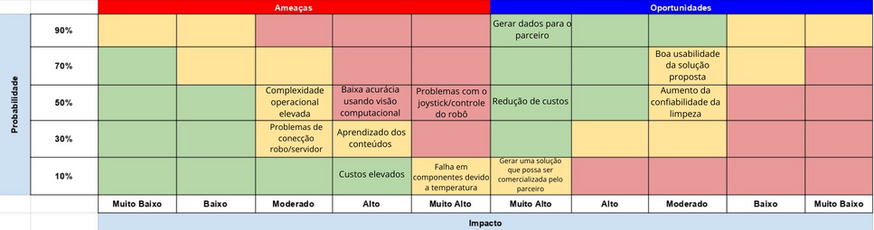

# Matriz de risco

No campo da gestão de projetos e operações, uma matriz de risco é uma ferramenta analítica projetada para auxiliar na identificação e avaliação de riscos potenciais. Utilizar uma matriz de risco é fundamental para entender a probabilidade e o impacto de diferentes riscos, possibilitando uma gestão mais eficaz e prevenção de problemas. O processo envolve a categorização dos riscos com base em critérios como severidade e frequência, facilitando a priorização de ações e a alocação de recursos.

Essa ferramenta não é um elemento estático, mas é moldada a partir de informações detalhadas sobre as vulnerabilidades e ameaças específicas do projeto ou operação em questão. A matriz de risco ajuda os gestores a tomarem decisões mais informadas, equilibrando entre riscos e oportunidades. Inclui detalhes como cenários de risco, níveis de tolerância e estratégias de mitigação. Orienta todas as etapas do projeto, assegurando que a gestão de riscos permaneça alinhada às metas e objetivos estratégicos.

No contexto deste projeto, a matriz de risco será a base para garantir que nossa abordagem seja proativa em relação aos desafios e incertezas. Ela capacita as equipes a desenvolverem respostas estratégicas e a manterem a resiliência operacional, fundamentais para o sucesso do projeto. Abaixo, apresentaremos uma visão geral sobre a matriz de risco desenvolvida pelo nosso grupo.

---

## Contenção de riscos

---

&emsp;&emsp;Custos elevados : Para evitar que o projeto tenha custos muito elevados para o parceiro, vamos procurar por robôs, câmeras e sensores que possam lidar especificamente com as condições do projeto, sem gastar demais com os componentes da solução, mas garantindo que possam resistir e ser durável por um tempo razoável estipulado sem a necessidade de sua troca.

&emsp;&emsp;Complexidade Operacional elevada : Para que nossa solução não exija que a Atvos ofereça demasiado treinamento especializado para os operadores da solução, faremos testes com usuários de nivelado letramento digital a fim de garantir o fácil uso da solução.

&emsp;&emsp;Baixa acurácia: Para mitigar o risco de baixa acurácia em modelos de visão computacional, é crucial aumentar a diversidade e a quantidade de dados no conjunto de treinamento. Além disso, deve-se realizar uma validação cruzada rigorosa para ajustar os parâmetros do modelo de forma otimizada. Também é recomendável utilizar técnicas de aumento de dados e, se necessário, explorar modelos pré-treinados ou arquiteturas mais avançadas para melhorar o desempenho.

&emsp;&emsp;Problemas com joystick/controle do robô : Para mitigar problemas com o joystick vamos indicar que seja usado um controle responsivo e que não tenha problemas para enviar comandos na distancia de uso desejada e que não tenha problemas com as condições do ambiente industrial proposto.

&emsp;&emsp;Problemas de conexão robô/servidor : Para garantir uma conexão confiável entre o robô e o servidor, implementaremos uma solução de rede que use protocolos de comunicação robustos. A estratégia envolve o uso de múltiplos canais de comunicação, com redundância para minimizar o risco de interrupções. Testes de carga e simulações de falhas serão conduzidos regularmente para assegurar que o sistema mantenha o desempenho sob diversas condições operacionais.

&emsp;&emsp;aprendizado dos conteúdos: Até agora, a experiência dos membros do grupo com o Ross não tem sido muito fácil. No entanto, com o auxílio dos professores e dedicação ao auto estudo, esperamos que a situação melhore ao longo do tempo.

&emsp;&emsp;Falha em componentes devido a temperatura elevada: Para abordar o risco de falhas devido a temperaturas elevadas, desenvolveremos um protótipo em escala menor para testar soluções de monitoramento térmico. Recomendaremos a compra de um robô comercial que já possua robustez térmica comprovada, equipado com sistemas avançados de controle de temperatura. Nosso protótipo servirá para validar as especificações necessárias e garantir que o robô adquirido atenda aos requisitos de operação segura.

