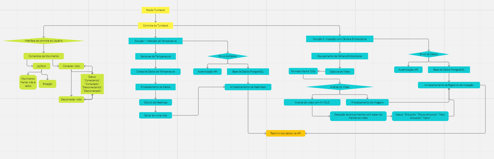
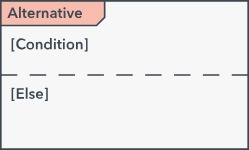

# Arquitetura de informação

&emsp;&emsp;A **arquitetura da informação** (AI) é uma disciplina do design que se concentra na organização, estrutura e rotulagem de conteúdo em sistemas de informação, como sites, aplicativos móveis e outros espaços digitais. Seu objetivo principal é criar interfaces intuitivas e eficientes que ajudem os usuários a encontrar e interagir com a informação de forma fácil e eficaz.

&emsp;&emsp;A AI é crucial para garantir que os usuários possam navegar de forma eficiente e encontrar o que estão procurando sem dificuldade. Ela aborda questões como a organização de conteúdo, a criação de esquemas de navegação claros, a rotulagem adequada de categorias e a hierarquia de informações.

&emsp;&emsp;A seguir, tem-se duas formas, com perspectivas diferentes, de representar a arquitetura de informação do projeto **Tacomaré**.

## Diagrama de Componentes

&emsp;&emsp;O Diagrama de Componentes é uma das ferramentas fundamentais da Linguagem de Modelagem Unificada (UML), que é amplamente utilizada no campo da engenharia de software para modelar sistemas de software complexos. Especificamente, o Diagrama de Componentes oferece uma representação visual dos componentes de um sistema e das relações entre eles.

&emsp;&emsp;Em termos simples, um componente é uma parte modular e independente de um sistema que encapsula uma funcionalidade específica. Pode ser um módulo de software, uma biblioteca, um serviço web ou qualquer outra unidade lógica que contribua para o funcionamento do sistema como um todo.

&emsp;&emsp;A seguir, tem-se o diagrama de componentes do projeto em questão:

Figura 1 - Diagrama de componentes

Fonte: Elaboração própria

&emsp;&emsp;O que está reprensentado de amarelo (duas celular iniciais superiores), é os dois principais elementos do sistema. Primeiramente, os Robôs TurtleBot, que serão utilizados para portar os sensores de temperatura e a câmera. Outro elemento essencial para o funcionamento do sistema, é o controle do robô, ferramenta utilizada para realizar possíveis movimentos do robô apenas com o controle.

&emsp;&emsp;Sabendo que, o controle será o elemento que mais será utilizado pelos usuários, em verde (núcleo à extrema esqueda da imagem), tem se a parte de visibilidade do sistema com o usuário final. É possível notar no diagrama, que a interface possui os comandos de movimento, onde encontra-se um *joystick* capaz de realizar movimentos de rotação e movimento do Robô TurtleBot. Além disso, na interface terá um feedback para o usuário ter conhecimento do status do sistema (Conectando, conectador, desconectando, desconectado), este elemento entra em conformidade com a primeira Heurística de Nielsen, "Visibilidade do Status do Sistema", que dita que o sistema deve informar ao usuário em qual ambiente ele se encontra, permitindo um maior controle dos utilizadores do sistema.

&emsp;&emsp;Em azul (núcleo maior), tem-se as duas soluções que o projeto Tacomaré irá cobrir:
- Solução 1: Medição de temperatura - A primeira solução do sistema se trata de mapear tubos que estão com resíduos durante a operação dos tanques da Atvos. Trazendo um contexto, a Atvos realiza a operação de nove meses corridos, para dar um melhor controle da limpeza dos tubos durante a operação, será implantado no TurtleBot sensores de temperatura, os dados coletados pelos sensores serão processados, e um cálculo de *Heatmap*(mapa de calor) será realizado, após isso os dados são salvos e armazenados em uma base de dados PostgresSQL.
- Solução 2: Inspeção com Câmera Endoscópica - A segunda solução foi pensada para ser utilizada durante o período fora das operações. Nesse período, que dura três meses, os funcionários da manutenção da Atvos realizam a limpeza de todos os tubos com um jato de água, a limpeza é realizada duas vezes, a segunda vez com o intuito de garantir que tudo está limpo devidamente. Nesse cenário, a solução se trata de uma câmera acoplada ao robô, que passará por debaixo dos canos e com a análise do vídeo para com a IA YOLO será feita uma detecção de entupimento com base nos frames do vídeo, após a primeira limpeza, assim a segunda limpeza será mais direcionada para os tubos que ainda possuem resíduos, gerando assim um gasto menor de água para a Atvos, além de diminuir o risco dos funcionários da manuteção e fazer com que o trabalho desses funcionários seja mais objetivo. No final da captura de imagens, todas as informações são armazenadas em uma base de dados PostgreSQL.
Todos os dados, de ambas soluções, são retornados via API, assim como solicitado pelo parceiro e representado no diagrama na cor laranja.

## Diagrama de sequência

&emsp;&emsp;O Diagrama de Sequência UML (Linguagem de Modelagem Unificada) é uma representação visual que delineia a interação dinâmica entre diferentes partes de um sistema durante a execução de um cenário específico. Esta ferramenta oferece uma visão sequencial das mensagens trocadas entre objetos ou componentes, destacando a ordem cronológica das ações em um processo.

&emsp;&emsp;No contexto do nosso projeto, o Diagrama de Sequência UML é uma ferramenta indispensável para demonstrar como diversos elementos, incluindo usuários, sistema, TurtleBot, sensores, câmera e banco de dados, colaboram em tempo real. Ele não apenas registra as etapas de interação, mas também evidencia como os diferentes componentes do sistema se comunicam para executar tarefas específicas. Ao empregar esse tipo de diagrama, conseguimos capturar de forma visual o fluxo de informações e comandos, desde a solicitação inicial do usuário até as respostas subsequentes do sistema. Isso não apenas facilita a compreensão dos processos internos, mas também estabelece uma base sólida para identificar possíveis pontos de falha ou áreas de otimização. 

&emsp;&emsp;A seguir tem se uma legenda do que cada elemento do diagrama representa:

Tabela 01 - Símbolos do Diagrama de Sequência UML

| Símbolo                                        | Nome                                      | Descrição                                                                                                      |
|------------------------------------------------|-------------------------------------------|----------------------------------------------------------------------------------------------------------------|
|       | Símbolo de Objetos                        | Representa uma classe ou objetos em UML. O símbolo do objeto demonstra como um objeto se comportará no contexto do sistema. Atributos de classe não devem ser listados nesta forma. |
|         | Caixa de Ativação                         | Representa o tempo necessário para que um objeto conclua uma tarefa. Quanto mais tempo a tarefa levar, mais alongada a caixa de ativação se torna. |
|             | Símbolo de Ator                          | Mostra as entidades que interagem com, ou são externas ao sistema.                                             |
|         | Símbolo de Pacote                        | Usada em notação UML 2.0 para conter elementos interativos do diagrama. Também conhecida como quadro, esta forma retangular tem um pequeno retângulo interno para rotular o diagrama. |
|  | Símbolo de Linha da Vida             | Representa a passagem do tempo, conforme estende-se para baixo. Esta linha vertical tracejada mostra os eventos sequenciais que ocorrem a um objeto durante o processo no gráfico. Linhas da vida podem começar com uma forma de retângulo rotulado ou um símbolo de ator. |
|  | Símbolo de Opção em Loop            | Usado para modelar cenários “se/então”, ou seja, uma circunstância que ocorrerá apenas sob determinadas condições. |
|   | Símbolo Alternativo                     | Simboliza uma escolha (geralmente mutuamente exclusiva) entre duas ou mais sequências de mensagens. Para representar alternativas, use a forma de retângulo rotulada com uma linha tracejada em seu interior. |
|  | Símbolo de Mensagens Síncronas | Representado por uma linha sólida com uma ponta de seta sólida. Este símbolo é usado quando um remetente deve esperar por uma resposta a uma mensagem antes de poder continuar. O diagrama deve mostrar tanto a chamada quanto a resposta. |
|  | Símbolo de Mensagens Assíncronas | Representado por uma linha sólida com uma ponta de seta em linha. Mensagens assíncronas não necessitam de uma resposta para que o remetente continue. Apenas a chamada deve ser incluída no diagrama. |
|  | Símbolo de Mensagens de Retorno Assíncronas | Representado por uma linha tracejada com uma ponta de seta em linha. |
|  | Símbolo Assíncrono de Criar Mensagem | Representado por uma linha tracejada com uma ponta de seta em linha. Esta mensagem cria um novo objeto. |
|  | Símbolo de Responder à Mensagem | Representado por uma linha tracejada com uma ponta de seta em linha, estas mensagens são respostas às chamadas. |
|  | Símbolo de Excluir Mensagem | Representado por uma linha sólida com uma ponta de seta sólida, seguida por um X. Esta mensagem destrói um objeto. |

Fonte: Elaboração própria

