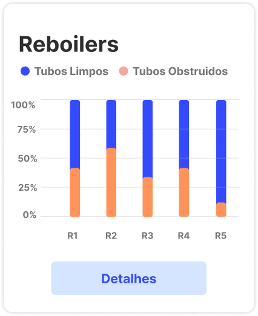
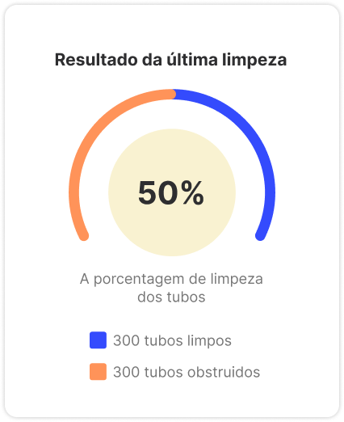

# Documentação da API e Sugestões de Gráficos

## Descrição dos Dados Disponíveis na API

### 1. Informações Gerais
A API fornece acesso aos seguintes dados:
- **Dados sobre a Limpeza dos Reboilers**: Informações detalhadas sobre a limpeza dos reboilers, incluindo a data da limpeza, a quantidade de tubos limpos, e a quantidade de tubos obstruídos.

### 2. Endpoints Disponíveis
- **GET /all_reboilers**: Retorna uma lista com os resultados da limpeza de todos os reboilers.
- **GET /reboilerX/monthly**: Retorna uma lista com os resultados das limpezas do último mês para um reboiler específico.
- **GET /reboilerX/last_clean**: Retorna os detalhes da última limpeza de um reboiler específico.

## Sugestões de Gráficos para a Plataforma de BI

### 1. Gráfico de Visualização de Todos os Reboilers
**Descrição**: Um gráfico de barras que mostra a porcentagem de tubos limpos e obstruídos na última limpeza de todos os reboilers registrados.  
**Utilidade**: Ajuda a identificar a eficiência geral da limpeza dos reboilers.  
**Exemplo**:

### 2. Gráfico de Visualização Mensal
**Descrição**: Um gráfico de colunas e linhas que mostra o desempenho das limpezas no último mês.  
**Utilidade**: Permite monitorar mudanças graduais no processo de limpeza que podem não ser percebidas na análise de limpezas individuais.  
**Exemplo**:

### 3. Gráfico da Última Limpeza
**Descrição**: Um gráfico de pizza que mostra a quantidade de tubos limpos e obstruídos na última limpeza.  
**Utilidade**: Facilita a visualização das informações de uma limpeza específica.  
**Exemplo**:

## Considerações Finais
Esta documentação visa fornecer uma visão clara e detalhada dos dados disponíveis na API, bem como sugestões de gráficos para facilitar a análise e visualização dos dados na plataforma de BI do cliente.

